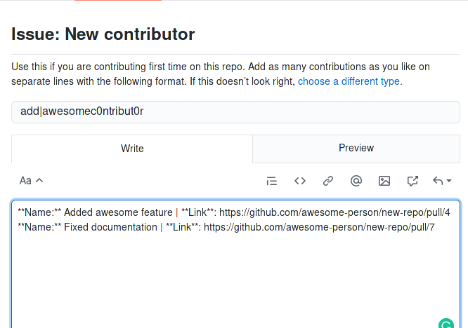
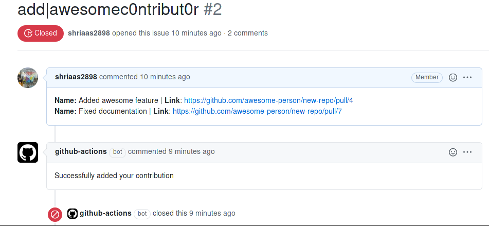
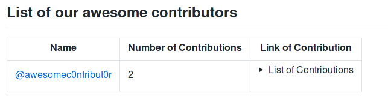
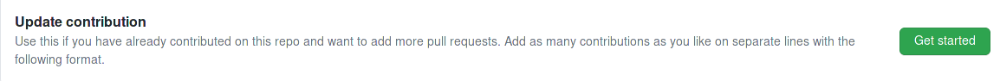
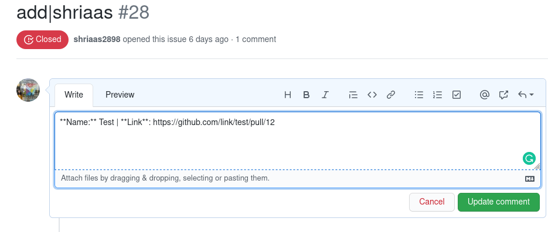
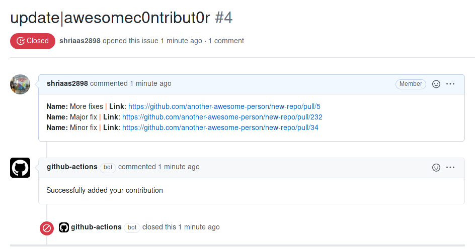
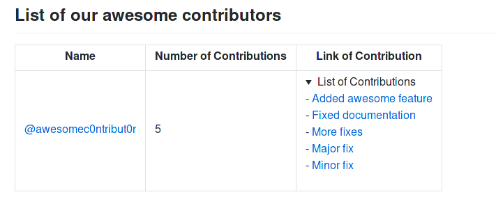

# CONTRIBUTING
Follow these guidelines to add your contributions to the leaderboard:

### If you are contributing for the first time: 
- Open a new issue with `New contributor` template: 

- Add your contribution:
  - Change 'username' in title to your username
  - Add name and link to your Pull Request in plain text, please do not use any formatting syntax. You can add as many PRs as you want here.

  
  - Submit the issue. And wait for notification.
  
  - If everything goes fine your issue will be closed and you will find something like this: 

  
  - And that's all you are on the leaderboard now!  

### If you want to add more contributions : 
- Open a new issue with `Update contribution` template

- Add your contribution:
  - Change 'username' in title to your username
  - Add name and link to your Pull Request in plain text, please do not use any formatting syntax. You can add as many PRs as you want here.

  
  - Submit the issue. And wait for notification.
  - If everything goes fine your issue will be closed and you will find something like this: 

  
  - And that's all you just added more awesome contributions leaderboard!  

### If you encounter any problem:
- If you get an error message as a comment on your issue like: 

  - Open a new issue to resolve it.
- If the changes are not reflected on the leaderboard even after getting a success message.
  - Open an issue explaining the problem and tag a moderator.
  
  
