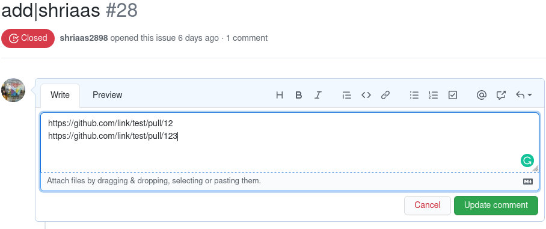

# CONTRIBUTING
Follow these guidelines to add your contributions to the leaderboard:

### If you are contributing for the first time: 
- Click the link in the README and add links for your Pull Requests.

### If you want to add more contributions : 
- Find the issue you have previously opened to add contributions
- Edit the issue and add the new links.
- Save the updated issue. And you are done!

#### If you have added contributions through old mechanism
  - Go to the first issue you opened for adding contribution, that is the issue which has title like `add|username`.
  - Edit the issue:
  
  - Just keep the links of contributions in the issue body:
   

### If you encounter any problem:
- If you get an error message as a comment on your issue.
  - Edit the issue to resolve it.
- If the changes are not reflected on the leaderboard even after getting a success message.
  - Open an issue explaining the problem and tag a moderator.
  
  
